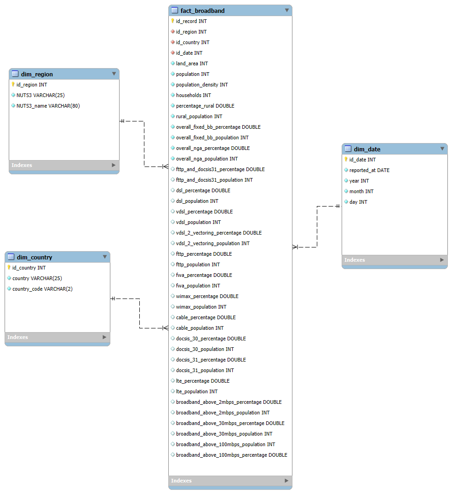

# European-Broadband-Markets-ETL
Implementácia ELT procesu v Snowflake a vytvorenie dátového skladu so schémou Star na datasete [European-Broadband-Markets-2017](https://app.snowflake.com/marketplace/listing/GZSVZ6EW2A/expert-intelligence-european-broadband-markets-2017?search=europe&pricing=free&available=available). Zameraním projektu je preskúmať pokrytie jednotlivých technológií prenosu dát na území Európy v roku 2017.

## 1. Úvod a popis zdrojových dát
Analyzujeme dáta o technológiach prenosu dát, ich pokrytí v jednotlivých štátoch a ich regiónov. Cieľ je:
- Zistiť prístupnosť prenosových technológií
- Identifikovať regióny

Dataset obsahuje jednu tabulku `EUROPEAN_BROADBAND_MARKETS_2017_FREE_DATASET`, ktorá obsahuje údáje o počte obyvateľov, domácností podľa regiónov a štátov a štatistiky o využívaní jednotlivých technológií (DSL, VDSL, FTTP...). 

Účelom ELT procesu je tieto dáta pripraviť, transformovať a sprístupniť na viacdimenzionálnu analýzu.

### 1.1 ERD diagram zdrojového datasetu
Relačný model dát z tohoto datasetu je znázornený v entitno-relačnom diagrame:

  
   
  <em>Obrázok 1 - Entitno_relačná schéma</em>

## 2. Dimenzionálny model
Návrh schémy hviezdy podľa Kimballovej metodológie, obsahuje 1 tabuľku faktov `fact_broadband`, ktorá je prepojená s nasledujúcimi 3 dimenziami:
- `dim_region` ukladá názov regiónu a jeho skratku. SCD typ 1
- `dim_country` ukladá krajinu a jej skratku. SCD typ 1
- `dim_date` obsahuje dátum merania štatistík. SCD typ 0

Tabulka faktov `fact_broadband` obsahuje PK `id_record`, FK `id_region, id_country, id_date` a ďalej údaje o ploche kraja, počte obyvateľov, hustoty obyvateľstva, počtu domácností a ďalšie údaje zamerané na počet obyvateľstva využívajúceho danú technológiu a jej percentuálna časť s celkového obyvateľstva. 

Schéma hviezdy je znázornená na diagrame pre vizualizáciu prepojenia medzi tabulkami dimenzií a tabulky faktov:

  
   
  <em>Obrázok 2 - Star schéma pre European-Broadband-Markets-2017</em>

## 3. ELT proces v Snowflake

## 4. Vizualizácia dát

**Autori:** [Matúš Gabaš](https://github.com/snickers-c) a [Juraj Daniš](https://github.com/Jur1n0)
